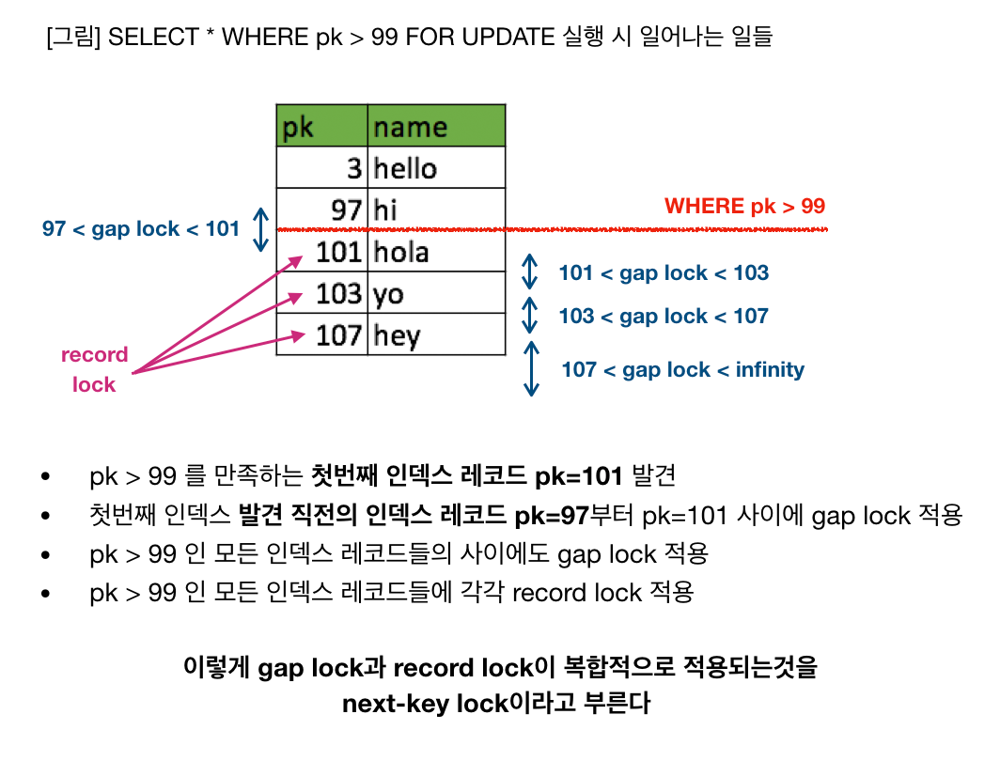

# DataBase - Transcation

## 1. 트랜잭션이란
- 데이터베이스의 상태를 변환시키는 하나의 논리적인 작업 단위
___

## 2. 트랜잭션의 성질(ACID)
- 원자성(Atomicity)
    - 트랜잭션의 작업이 부분적으로 실행되거나 중단 될 수 없다.
    - 트랜잭션의 모든 연산들은 정상적으로 수행 완료되거나 아니면 전혀 어떠한 연산도 수행되지 않은 상태를 보장해야 한다. (All or Nothing)
- 일관성(Consistency)
    - 트랜잭션 완료 후 일관적인 DB 상태를 유지한다.
        - ex) 데이터 타입이 정수 &rarr; 문자열이 될 수 없음.
- 독립성(Isolation)
    - 하나의 트랜잭션이 실행하는 도중에 변경한 데이터는 이 트랜잭션이 완료될 때까지 다른 트랜잭션이 참조하지 못한다.
    - 즉, 트랜잭션 끼리는 서로 간섭할 수 없다.
- 지속성(Durability)
    - 성공적으로 수행된 트랜잭션은 영원히 반영이 된다.
    - commit을 하게 되면 현재 상태는 영원히 보장된다.

### 2-1. 원자성을 보장하는 방법
- 현재 수행중인 트랜잭션에 의해 변경된 내용을 유지하면서, 이전에 commit된 상태를 임시 영역에 따로 저장함으로써 보장한다.
- 즉, 현재 수행하는 트랜잭션에서 오류가 발생하게 되면, 임시 영역에 저장한 데이터로 rollback을 하게 된다.

### 2-2. 일관성 보장
- 트랜잭션 수행 전, 후 데이터의 모델의 제약 조건을 만족하는 것으로 보장한다.
- 제약조건 : 기본키, 외래키, 도메인, 도메인 제약조건 등...

### 2-3. 독립성 보장
- 병행 처리 :
    - 트랜젹션에 정해진 시간을 할당하여 작업을 하고, 정해진 시간 종료 후 다른 트랙잭션을 실행하는 방식으로 트랜잭션을 처리한다.
    - 이런 경우, 공통된 데이터를 조작하게 되며, 데이터가 혼란스러워 질 수 있음.
- OS의 Semaphore와 비슷한 개념으로 lock & excute unlock을 통해 고립성을 보장한다.
- 즉, 데이터를 읽거나 쓸 때는 다른 트랜잭션이 접근하지 못하도록 lock을 걸어 고립성을 보장하고, 수행이 종료 된 후 unlock을 통해 다른 트랜잭션이 접근 할 수 있도록 한다.
- 단, 이과정에서 deadlock이 발생 할 수 있음
- 2PL 프로토콜(2 Phase Lock Protocol)
    - 2PL 프로토콜이란 여러 트랜잭션이 공유하고 있는 데이터에 동시에 접근할 수 없도록 하기위한 목적을 가진 프로토콜
    - growing phase(상승단계): read_lock , write_lock
    - shrinking phase(하강단계) : unlock
    - 상승과 하강 단계는 섞일 수 없음 &rarr; lock과 unlock이 번갈아 수행되지 않고 lock이 수행 된 후 unlock이 수행되어야 한다.
    
        ;
- 즉, 트랜잭션 처리 성능을 위해 병행 처리를 사용해야함 -> 이 과정에서 독립성을 보장하기 위하여 2PL 프로토콜을 사용한다.(deadlock이 발생하지 않기 위해)
- 보수적 locking ( conservative locking )
    - 트랜잭션이 시작되면 모든 lock을 얻는 방식으로서, 데드락이 발생하지 않지만 병행성이 좋지 못함
- 엄격한 locking ( strict locking )
    - 트랜잭션이 commit을 만날 때까지 lock을 갖고 있다가 commit을 만날때 unlock을 하는 방식으로 데드락이 발생하지만 병행성이 좋음
    - 일반적으로 병행성이 좋은 strict 방식을 사용


___

## 3. 트랜잭션 격리수준(Isolation Level)


### 3-1. 트랜잭션 격리 수준이란.

- 트랜잭션에서 일관성이 없는 데이터를 허용하도록 하는 수준
- 즉, 실행 중인 트랜잭션의 중간결과를 다른 트랜잭션이 접근 할 수 없다.
- 이러한 격리성은 강하게~약하게 처리할 수 있다.
- 격리수준의 종류
    - read uncommited(dirty read)
    - read commited
    - repeatable read
    - serializable

### 3-2. MySQL, MariaDB의 Lock

- MySQL, MariaDB 모두 `InnoDB`를 사용하고 있어 이를 기반으로 정리
- MySQL의 Lock 레벨로는 row(행) 단위의 Lock을 기본으로 사용하며 Lock의 종류로는 공유(Shared) Lock과 배타(Exclusive) Lock을 사용

**Shared Lock(S)**
- Row-Level Lock
- select를 위한 Read Lock
- Shared Lock이 걸려있는 동안 다른 트랜잭션이 해당 row에 대해 X lock 획득(exclusive write)은 불가능하지만 S lock 획득(shared read)은 가능
- 한 row에 대해 여러 트랜잭션이 동시에 `S` Lock 획득 가능

**Exclusive Lock(X)**
- Row-level lock
- write lock
- exclusive lock이 걸려있으면 다른 트랜잭션이 해당 row에 대해 X, S lock을 모두 획득하지 못하고 대기해야 한다.

    
**Record Lock(Row Lock)**

Record Lock이란 row index를 기준으로 Lock을 사용합니다.  
예를 들어 `SELECT c1 FROM t WHERE c1 = 10 FOR UPDTAE;` 행을 다른 트랜잭션이 변경 할 수 없도록 합니다.  
Record Lock은 테이블에 인덱스가 정의 되지 않은 경우에도 innoDB에서 숨겨진 클러스터 인덱스를 생성하고 이를 Record Lock에 활용합니다.

Record Lock 이 설정된 것을 확인한 로그

```sql
mysql > SHOW ENGINE INNODB STATUS;

RECORD LOCKS space id 58 page no 3 n bits 72 index `PRIMARY` of table `test`.`t`
trx id 10078 lock_mode X locks rec but not gap
Record lock, heap no 2 PHYSICAL RECORD: n_fields 3; compact format; info bits 0
 0: len 4; hex 8000000a; asc     ;;
 1: len 6; hex 00000000274f; asc     'O;;
 2: len 7; hex b60000019d0110; asc        ;;
```


**Gap Lock**

GAP LOCK은 인덱스 레코드 간의 GAP, 첫번째 인덱스 레코드의 앞 혹은 마지막 인덱스 레코드 뒤의 GAP에 대한 LOCK 이다.  
예를 들어, 모든 기존 값 사이의 GAP이 잠겨있기 때문에 열에 해당 값이 이미 있는지 여부에 관계 없이
`SELECT c1 FROM t WHERE BETWEEN 10 and 20 FOR UPDATE;` 와 같은 쿼리를 실행 하였을 때 다른 트랜잭션이 이 사이에 값을 삽입하지 못하도록 한다.
        
**Next-Key Lock**

Next-Key Lock은 Record Lock 과 GAP Lock이 조합된 형태의 Lock 이다.




### 참고자료 및 이미지 출처
- https://victorydntmd.tistory.com/129
- https://dev.mysql.com/doc/refman/8.0/en/innodb-locking.html#innodb-record-locks
- https://www.letmecompile.com/mysql-innodb-lock-deadlock/